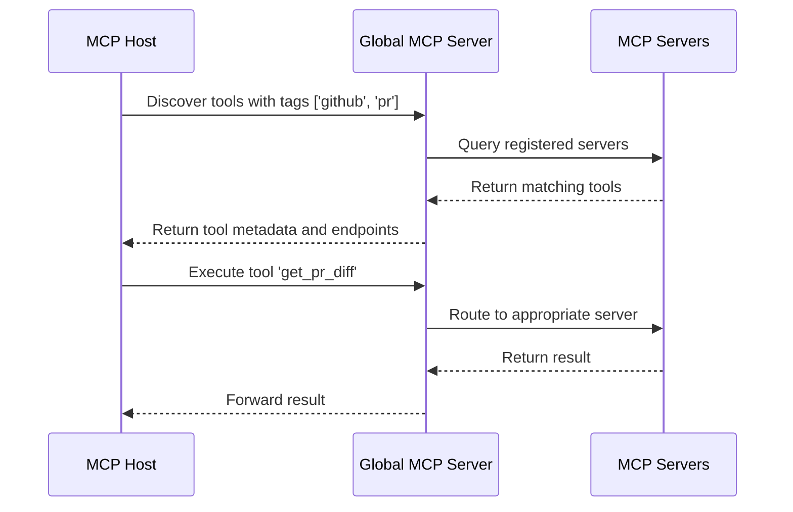

I'll analyze the codebase to understand the PR reviewer MCP architecture and then design a similar system for the release notes assembler. Let's start by exploring the codebase structure.


Let me examine the main components of the PR reviewer MCP application to understand its architecture.


Let me examine the server components to understand the MCP architecture better.


Let me examine the Asana server component to better understand the MCP architecture.


Let me analyze the PR reviewer MCP architecture and propose a similar design for the Release Notes Assembler.

# Analysis of PR Reviewer MCP Architecture

## Current Architecture Overview

The PR Reviewer MCP application follows a distributed architecture with these key components:

1. **MCP Host**:
   - Central controller that manages the workflow
   - Uses Gemini AI model for processing
   - Manages connections to various MCP servers
   - Handles tool orchestration and execution

2. **MCP Servers**:
   - **GitHub Server**: Handles GitHub API interactions (PRs, comments, diffs)
   - **Asana Server**: Manages Asana tasks and project tracking
   - Each server exposes specific tools as MCP endpoints

3. **Communication**:
   - Uses FastMCP framework for server implementation
   - HTTP-based communication between host and servers
   - Tools are exposed as decorated functions with metadata

4. **Tooling**:
   - Tools are annotated with descriptions, tags, and annotations
   - Each tool is tracked with opik for observability
   - Tools can be marked as read-only or read-write

# Proposed Architecture: Release Notes Assembler

## High-Level Architecture

```
┌───────────────────────────────────────────────────────────────┐
│                      Release Notes MCP Host                   │
│  ┌───────────────────────────────────────────────────────┐   │
│  │  Release Notes Orchestrator                          │   │
│  │  - Tracks merged PRs                                 │   │
│  │  - Generates audience-specific notes                 │   │
│  │  - Manages distribution workflow                    │   │
│  └───────────────────────────┬───────────────────────────┘   │
└──────────────────────────────┼───────────────────────────────┘
                               │
         ┌─────────────────────┼─────────────────────┐
         │                     │                     │
         ▼                     ▼                     ▼
┌─────────────────┐  ┌─────────────────┐  ┌───────────────────┐
│  GitHub Server  │  │   Asana Server  │  │    Slack Server   │
│  - Get PRs      │  │  - Get tasks    │  │  - Post messages  │
│  - Track merges │  │  - Update tasks │  └───────────────────┘
└─────────────────┘  └─────────────────┘
```

## Component Breakdown

### 1. MCP Host: Release Notes Orchestrator

**Core Responsibilities**:
- Track merged PRs on a scheduled basis
- Generate audience-specific release notes
- Coordinate with MCP servers for data collection
- Format and distribute release notes

**Key Tools/Endpoints**:
- `get_merged_prs(since: datetime, labels: List[str])`: Fetches merged PRs
- `generate_release_notes(prs: List[PR], audience: str)`: Generates notes for specific audience
- `publish_release_notes(notes: str, target: str)`: Publishes to Slack/Asana

### 2. MCP Servers

#### a) GitHub Server
- **Purpose**: Interact with GitHub API
- **Tools**:
  - `get_merged_prs(since: str, labels: List[str])`: Get merged PRs with filters
  - `get_pr_details(owner: str, repo: str, pr_number: int)`: Get detailed PR info
  - `get_pr_labels(owner: str, repo: str, pr_number: int)`: Get PR labels

#### b) Asana Server
- **Purpose**: Manage tasks and milestones
- **Tools**:
  - `get_milestone_tasks(milestone_id: str)`: Get tasks in a milestone
  - `attach_to_milestone(milestone_id: str, content: str, title: str)`: Attach notes
  - `create_milestone_comment(milestone_id: str, comment: str)`: Add comment

#### c) Slack Server
- **Purpose**: Post messages to Slack
- **Tools**:
  - `post_message(channel: str, message: str, attachments: List[dict])`: Post to channel
  - `update_message(channel: str, ts: str, message: str)`: Update existing message

## Workflow

1. **Scheduled Trigger**:
   - Host runs on a schedule (e.g., every Friday)
   - Identifies time window (e.g., last week)

2. **Data Collection**:
   - Fetches merged PRs from GitHub
   - Retrieves linked Asana tasks
   - Groups by feature/area using labels

3. **Content Generation**:
   - For each audience (internal, customers, support):
     - Filter relevant PRs/tasks
     - Generate appropriate content format
     - Apply audience-specific formatting

4. **Distribution**:
   - Post customer-facing notes to Slack
   - Attach detailed notes to Asana milestone
   - Update tracking systems

## Implementation Considerations

1. **Idempotency**:
   - Track processed PRs to avoid duplicates
   - Use timestamps for incremental updates

2. **Error Handling**:
   - Retry mechanisms for API failures
   - Fallback content generation
   - Notification on failures

3. **Performance**:
   - Parallel processing of PRs
   - Caching of static data
   - Rate limiting awareness

4. **Security**:
   - Secure credential management
   - Minimal required permissions
   - Input validation

## Example Tool Implementation

```python
@github_mcp.tool(
    description="Get merged pull requests with optional filters",
    tags={"github", "pull_request", "merged"},
    annotations={"title": "Get Merged PRs", "readOnlyHint": True}
)
async def get_merged_prs(
    owner: str,
    repo: str,
    since: str,  # ISO format datetime
    labels: List[str] = None
) -> List[dict]:
    """Fetch merged pull requests with optional label filtering."""
    # Implementation using GitHub API
    pass

@slack_mcp.tool(
    description="Post release notes to a Slack channel",
    tags={"slack", "release_notes", "notification"},
    annotations={"title": "Post Release Notes", "readOnlyHint": False}
)
async def post_release_notes(
    channel: str,
    version: str,
    notes: str,
    is_critical: bool = False
) -> dict:
    """Post formatted release notes to Slack."""
    # Implementation using Slack API
    pass
```


# Enhanced Architecture: Global MCP Server Design

## Global MCP Server Overview

The Global MCP Server acts as the central registry and orchestration layer for all MCP tools and services. It's the backbone that enables dynamic service discovery, routing, and tool management across the MCP ecosystem.

## Core Components

### 1. Tool Registry Service
- **Tool Catalog**: Maintains a real-time registry of all available tools across all MCP servers
- **Metadata Store**: Stores tool metadata including:
  - Name and description
  - Input/output schemas
  - Tags and categories
  - Versioning information
  - Performance metrics and health status

### 2. Service Discovery Layer
- **Dynamic Registration**: Automatically registers new MCP servers and their tools
- **Health Monitoring**: Tracks server availability and performance
- **Load Balancing**: Distributes requests across multiple instances of the same tool

### 3. Routing Engine
- **Tag-based Routing**: Routes requests based on tool tags (e.g., `github`, `pr`, `code_review`)
- **Version Management**: Handles version compatibility between tools
- **Fallback Strategies**: Implements failover mechanisms for high availability

## Integration with Other Components

### 1. MCP Host Interaction


### 2. Tool Discovery Flow
1. **Registration**:
   - MCP Servers register their tools with the Global Server on startup
   - Each tool provides metadata including name, description, and tags
   - Tools can be updated or removed dynamically

2. **Discovery**:
   - Hosts query the Global Server for tools by tags or capabilities
   - Global Server returns available tools that match the criteria
   - Host caches tool information for performance

3. **Execution**:
   - Host sends tool execution requests to the Global Server
   - Global Server routes to the appropriate MCP Server
   - Results are returned through the same path

## Implementation Details

### 1. Tool Registration Endpoint
```python
@global_mcp.tool(
    description="Register a new tool with the Global MCP Server",
    tags=["system", "admin"],
    annotations={"adminOnly": True}
)
async def register_tool(
    tool_name: str,
    description: str,
    endpoint: str,
    input_schema: dict,
    output_schema: dict,
    tags: List[str],
    version: str = "1.0.0",
    server_id: str
) -> dict:
    """Register a new tool with the Global MCP Server"""
    # Implementation for tool registration
    pass
```

### 2. Tool Discovery Endpoint
```python
@global_mcp.tool(
    description="Discover available tools by tags",
    tags=["discovery"],
    annotations={"readOnlyHint": True}
)
async def discover_tools(
    tags: List[str] = None,
    required_capabilities: List[str] = None,
    min_version: str = None
) -> List[dict]:
    """Discover tools matching the specified criteria"""
    # Implementation for tool discovery
    pass
```

### 3. Tool Execution Endpoint
```python
@global_mcp.tool(
    description="Execute a tool through the Global MCP Server",
    tags=["execution"]
)
async def execute_tool(
    tool_name: str,
    parameters: dict,
    version_constraint: str = None,
    preferred_server: str = None
) -> dict:
    """Execute a tool through the Global MCP Server"""
    # Implementation for tool execution
    pass
```

## Advanced Features

### 1. Dynamic Load Balancing
- Distributes load across multiple instances of the same tool
- Implements circuit breakers for fault tolerance
- Provides metrics for capacity planning

### 2. Security Layer
- Authentication and authorization for all tool access
- Rate limiting and quota management
- Audit logging for compliance

### 3. Caching System
- Caches tool responses based on TTL
- Implements cache invalidation strategies
- Supports distributed caching for high availability

## Example Workflow: Release Notes Generation

1. **Tool Registration**:
   - GitHub MCP Server registers `get_merged_prs` with tags: `["github", "pr", "code"]`
   - Asana MCP Server registers `get_milestone_tasks` with tags: `["asana", "tasks", "milestone"]`
   - Slack MCP Server registers `post_message` with tags: `["slack", "notifications"]`

2. **Tool Discovery**:
   ```python
   # Host discovers tools for release notes generation
   tools = await global_mcp.discover_tools(
       tags=["github", "asana", "slack"],
       required_capabilities=["read_prs", "read_tasks", "post_messages"]
   )
   ```

3. **Tool Execution**:
   ```python
   # Get merged PRs
   prs = await global_mcp.execute_tool(
       tool_name="get_merged_prs",
       parameters={
           "owner": "org",
           "repo": "repo",
           "since": "2025-09-03",
           "labels": ["feature", "bugfix"]
       }
   )
   ```

## Benefits of This Architecture

1. **Decoupling**: Hosts don't need to know about individual server implementations
2. **Scalability**: New tools and servers can be added without modifying existing hosts
3. **Maintainability**: Centralized tool management and versioning
4. **Flexibility**: Tools can be composed in various ways for different workflows
5. **Observability**: Centralized logging and metrics for all tool usage

## Implementation Considerations

1. **Performance**: 
   - Implement connection pooling
   - Use async I/O for high concurrency
   - Cache frequently accessed tool metadata

2. **Reliability**:
   - Implement retry mechanisms
   - Handle network partitions gracefully
   - Maintain service discovery during partial failures

3. **Security**:
   - Encrypt all communications
   - Implement fine-grained access control
   - Regular security audits

4. **Monitoring**:
   - Track tool usage patterns
   - Monitor system health
   - Set up alerts for abnormal conditions


# FastMCP Interface in MCP Architecture: Deep Dive

The FastMCP interface is a critical component that enables the Model Context Protocol's flexibility and modularity. Let me break down how it's used in the context of the global tool registry.

## Core FastMCP Implementation

The [McpServersRegistry](cci:2://file:///Users/teddytesfa/projects/AI-data-science-and-ML/enterprise-mcp-course/apps/pr-reviewer-mcp-servers/src/servers/tool_registry.py:15:0-46:28) class demonstrates the power of FastMCP as a central registry:

```python
class McpServersRegistry:
    def __init__(self):
        self.registry = FastMCP("tool_registry")
        self.all_tags: Set[str] = set()
        self._is_initialized = False
```

### Key Aspects of FastMCP Integration

1. **Server Initialization**:
   - Each MCP server (GitHub, Asana, Slack) is a FastMCP instance
   - The registry imports these servers with unique prefixes to avoid naming conflicts

2. **Tool Discovery**:
   ```python
   all_tools = await self.registry.get_tools()
   for tool in all_tools.values():
       if tool.tags:
           self.all_tags.update(tool.tags)
   ```
   - Centralized tool discovery across all registered servers
   - Automatic tag aggregation for filtering

3. **Server Registration**:
   ```python
   await self.registry.import_server(asana_mcp, prefix="asana")
   await self.registry.import_server(agent_scope_mcp, prefix="scope")
   await self.registry.import_server(slack_mcp, prefix="slack")
   await self.registry.import_server(github_mcp, prefix="github")
   ```

## FastMCP in Action: Tool Registration

When a server registers with the global registry:

1. **Server Definition** (e.g., GitHub server):
   ```python
   github_mcp = FastMCP("github_tools")
   
   @github_mcp.tool(
       description="Get pull request details",
       tags={"github", "pull_request", "details"},
       annotations={"readOnlyHint": True}
   )
   async def get_pull_request(owner: str, repo: str, pull_number: int):
       # Implementation
       pass
   ```

2. **Registration Flow**:
   - The server starts and registers with the global registry
   - All tools are imported with the specified prefix
   - Tool metadata is indexed for discovery

## Key Features of FastMCP

1. **Standardized Tool Definition**:
   - Consistent interface for all tools
   - Built-in metadata support (descriptions, tags, annotations)
   - Type hints and validation

2. **Dynamic Discovery**:
   - Tools can be discovered at runtime
   - Filtering by tags, capabilities, or other metadata
   - Support for versioning and deprecation

3. **Composition**:
   - Tools from different servers can be composed
   - Namespacing through prefixes prevents collisions
   - Supports both synchronous and asynchronous operations

## Implementation Pattern for Release Notes Assembler

Here's how you'd implement the registry for the Release Notes Assembler:

```python
class ReleaseNotesRegistry:
    def __init__(self):
        self.registry = FastMCP("release_notes_registry")
        self._is_initialized = False

    async def initialize(self):
        if self._is_initialized:
            return

        # Import all MCP servers
        await self.registry.import_server(github_mcp, prefix="github")
        await self.registry.import_server(asana_mcp, prefix="asana")
        await self.registry.import_server(slack_mcp, prefix="slack")
        await self.registry.import_server(release_notes_mcp, prefix="release_notes")
        
        # Initialize tool cache
        await self._build_tool_cache()
        self._is_initialized = True

    async def _build_tool_cache(self):
        """Cache tool metadata for faster lookups"""
        self.tools = await self.registry.get_tools()
        self.tags = set()
        
        for tool in self.tools.values():
            if tool.tags:
                self.tags.update(tool.tags)
```

## Benefits of This Approach

1. **Decoupled Architecture**:
   - Each service remains independent
   - Services can be developed and deployed separately
   - Easy to add or remove services

2. **Scalability**:
   - Horizontal scaling of individual services
   - Load balancing across service instances
   - Caching at multiple levels

3. **Maintainability**:
   - Clear separation of concerns
   - Standardized interfaces
   - Centralized tool discovery and documentation

4. **Flexibility**:
   - Mix and match tools from different providers
   - Dynamic tool composition
   - Runtime discovery of new capabilities

This architecture ensures that the Release Notes Assembler can evolve independently of the tools it uses, while maintaining a clean, maintainable codebase.